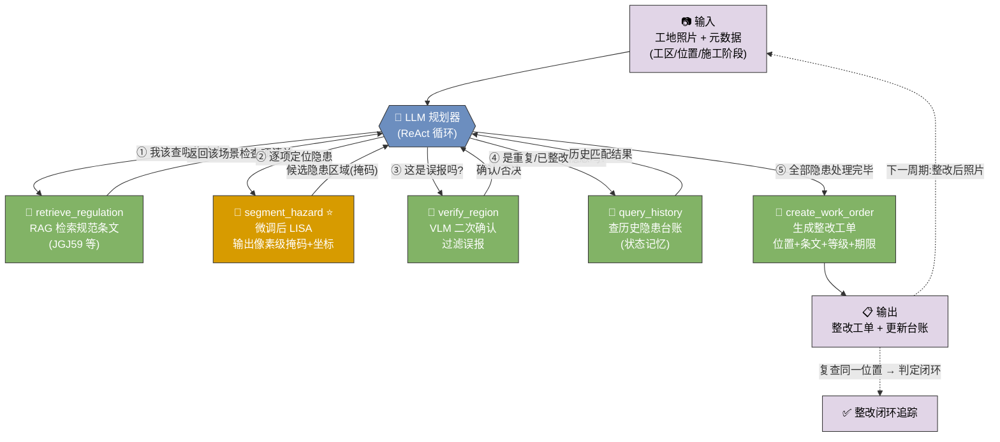
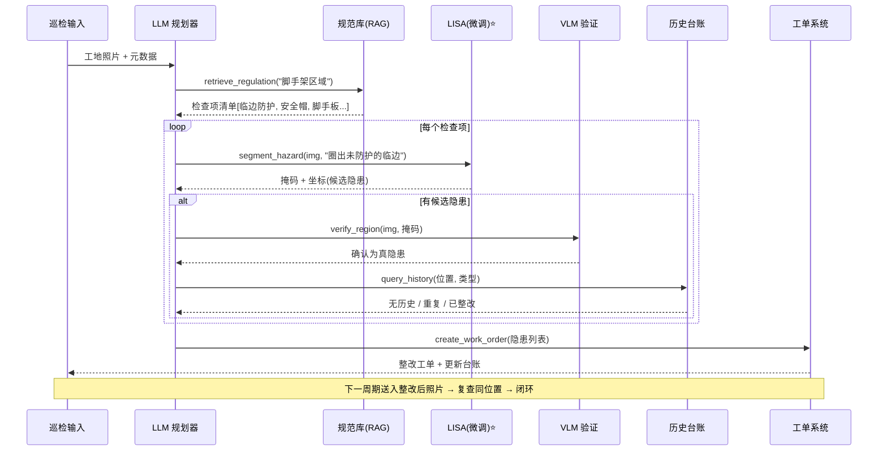
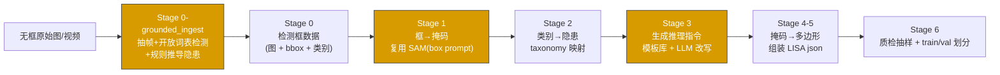

# Agent 应用开发岗 · 面试准备文档

> 目标岗位:Agent 应用开发
> 简历项目:在建筑施工场景对多模态模型 LISA 做微调
> 更新日期:2026-07-05
>
> **本文档按"面试实际提问顺序"排版**:开场产品需求 → 项目介绍/定位 → STAR 故事 →
> 为什么是 Agent → 架构设计 → 深挖答辩 → 技术落地 → 扩展性 → 简历/追问/待办。

---

## ⭐ 简历文案(可直接粘贴 · 定稿版)

> 用于 Agent 应用开发岗。**主语是 Agent,LISA 是被编排的一个视觉工具**——这是简历要一眼传达的定位。
> 带 `【】` 的是**待微调跑完回填的数字**,别留空上简历。

### 版本 A · 段落版(适合项目经历正文)

> **施工安全巡检 Agent(多模态 · LLM 编排)** — 独立设计并实现一个以微调 LISA 为「视觉定位工具」的 ReAct Agent,用 LLM 规划器编排 **RAG(规范检索)/ LISA(隐患分割)/ VLM(误报复核)/ 工单** 四类工具,打通"自然语言查隐患 → 像素级定位 → 违规判定 → 生成整改工单 → 跨周期闭环追踪"全流程。针对施工领域无现成"指令-掩码"数据的痛点,设计 **SAM + LLM 半自动数据合成流水线**,把廉价检测框零标注升级为 LISA 训练三元组,产出 【N】 组样本、标注成本近乎归零;基于 **LoRA** 微调 LISA(可训练参数占比仅 【X%】,单卡 24G 可训),施工场景 mIoU 由 【A】 提升至 【B】;引入 VLM 二次确认将误报率降低 【Y%】,单张巡检耗时由人工 【N】 分钟降至 【M】 秒。

### 版本 B · 要点版(适合 bullet 排版的简历)

> **施工安全巡检 Agent(多模态)** —— *Agent 应用开发 · 独立完成*
> - **系统设计**:以 ReAct 规划器编排 RAG / LISA / VLM / 工单 四类工具,实现"识别→定位→判定→整改→闭环追踪"多步流程;LISA 仅作其中的视觉定位工具,凸显编排与工程能力而非单模型。
> - **数据合成流水线**:针对无"指令-掩码"数据,设计 SAM(框→掩码)+ LLM(类别→推理指令)自动流水线 + 面积/IoU 质检,产出 【N】 组训练样本,标注成本由 O(N) 降至近 0。
> - **模型微调**:LoRA 微调 LISA(可训练参数仅 【X%】,单卡 24G),施工场景 mIoU 【A】→【B】。
> - **工程降误报**:加入 VLM 二次确认过滤 LISA 误报,误报率降 【Y%】;单张巡检 【N】 分钟 → 【M】 秒。

### 一句话电梯版(自我介绍/项目一句话概括)

> 把开源推理分割模型 LISA 微调成施工隐患的「视觉定位工具」,再用 LLM 规划器把它和 RAG、VLM、工单系统编排成一个能自动闭环整改的安全巡检 Agent——**难点和亮点都在编排与数据工程,不在单模型**。

### 回填数字对照(跑完远程实验来这查)

| 占位 | 含义 | 从哪来 |
|---|---|---|
| 【N】样本量 | 合成训练样本数 | `build_dataset.py` 产物 / `out/` 统计 |
| 【X%】可训练参数占比 | LoRA 参数 / 总参数 | 训练日志 trainable params |
| 【A】→【B】mIoU | 微调前后施工场景 mIoU | §6.4 微调前后对比评估 |
| 【Y%】误报率降幅 | 加 VLM 验证前后 | 小测试集人工核验 |
| 【N】分→【M】秒 | 人工 vs Agent 单张耗时 | 端到端计时 |

> ⚠️ 数字没跑出来前:宁可**少写数字**也别编;可先用"可训练参数<1%""单卡 24G 可训"这类**结构性事实**(不依赖实验结果)顶着,mIoU/误报率等结果类数字等评估跑完再补。

---

## 0. 核心定位(贯穿全程,先想清楚)

**LISA 本质是"推理分割"(reasoning segmentation)多模态模型,不是 Agent。**
面试 Agent 岗位时,面试官很可能会问:"这跟 Agent 有什么关系?"必须先打通这个逻辑,否则项目会被认为"跑偏"。

正确叙事:

> 构建一个**施工安全巡检 Agent**,LISA 作为其中的"**视觉定位工具**",被 LLM 规划器按需调用。

这样同时讲清两件事:**多模态微调能力** + **Agent 系统设计能力**——这才是 Agent 岗位想要的。

---

## 1. 开场:产品需求怎么答(面试常从这里开始)

面试官从"产品需求"切入,考的不是技术,而是**你懂不懂自己解决的是什么问题、给谁用、值不值得做**。
**先用产品语言讲清需求,等追问再下钻技术**;上来就讲模型 = 掉分。

**回答框架(6 点按序)**:①用户是谁(用/买单/受影响)→ ②痛点(量化)→ ③为什么现有方案不行 →
④产品目标(可衡量)→ ⑤为什么必须 Agent/多模态 → ⑥MVP 边界。

**口述稿(60–90 秒)**:
> 面向**施工企业安全管理**。直接用户是**安全员**,买单方是**项目经理/安全总监**(事故处罚、停工成本极高)。
> 痛点:隐患排查**靠人工巡检**,一个大工地几百个作业面看不过来、**漏检率高**;整改**靠 Excel + 微信催**、**闭环管不住**。
> 现有 AI 检测**只能查固定类别**(有没有安全帽),但真正危险的是**开放/组合语义**('临边有没有防护''脚手板有没有满铺'),固定模型覆盖不了。
> 产品目标:**拍照/接摄像头 → 自然语言查隐患 → 精确定位 → 自动开整改工单 → 追踪闭环**,核心指标是**隐患检出率**和**整改闭环率**。
> 这决定了它必须是 **Agent**(查规范判违规 + 降误报 + 跨周期追踪,多工具多步),LISA 只是里面"看图定位"的视觉工具。
> 落地先做 MVP:**聚焦安全帽/反光衣/临边等高频高危隐患**,跑通闭环再横向扩展。

**三个坑**:①别一上来讲模型/LoRA;②痛点要具体可量化(不是"效率低");③讲成**闭环产品**而非单个功能。

**可能的追问**:
- "需求是真的吗?" → 面向真实痛点的**自驱项目**,别编造甲方;讲清安全是施工刚需 + 监管强制。
- "为什么是安全员用,不是工人?" → 决策/考核在安全员与管理层,工人是被监督方(展示利益相关方思考)。
- "MVP 为什么先做这几类?" → 高频 + 高危 + 数据可得,ROI 最高(展示优先级取舍)。

---

## 2. 项目故事线(STAR · "介绍下你的项目")

> 面试官听的不是"你会微调",而是"你会不会定义问题、做技术取舍、扛住落地难题"。

**S 背景**:施工现场安全隐患靠人工巡检,漏检率高、整改追踪靠 Excel。业务方想要"拍张照就能自动查隐患并追踪整改"。难点在于——隐患是**开放/组合语义**("临边未防护""脚手板未满铺"),固定类别检测模型覆盖不了。

**T 任务**:我负责设计并落地一个**安全巡检 Agent**,能理解自然语言隐患描述、精确定位、判定违规、生成并追踪整改工单。

**A 行动 & 取舍**(重点讲"为什么这么选"):
1. **为什么用 Agent 而非单模型**:判定违规要查规范、要降误报、要追踪闭环——是多工具多步流程,所以用 ReAct 规划器编排 LISA / RAG / VLM / 工单 四类工具。
2. **为什么微调 LISA 而非直接用 GPT-4V/Qwen-VL**:①通用 VLM 只给粗坐标、无像素掩码,量不了"未防护临边长度";②对施工领域概念(临边、脚手板、露筋)理解差;③工地数据合规 + 私有化部署 + 延迟成本,不能走云。→ 用 LoRA 给 LISA 注入领域语义,单卡可训。
3. **数据怎么来**:没有现成"指令-掩码"数据,我设计了半自动合成流水线——用现成检测数据集生成掩码,再用 LLM 把类别改写成推理式指令,人工抽检。
4. **误报怎么办**:LISA 单独用误报偏高,我在 Agent 里加了 VLM 二次确认这一步,用工程手段兜住模型缺陷。

**R 结果**:施工场景 mIoU 从 A→B,加验证步后误报率降 X%,整改闭环可自动追踪,单张巡检从人工 N 分钟降到 M 秒。(数字待补)

**一句话升华**:这个项目让我理解到——**Agent 的价值不在单个模型多强,而在于用编排和工程手段把不完美的模型组合成可用的闭环系统。**

---

## 3. 为什么是 Agent 而不是单模型

### 3.1 LISA 在 Agent 里的角色

LISA 的能力:根据自然语言复杂指令,输出图像中对应区域的分割掩码(reasoning segmentation)。
在建筑施工场景,它天然适合做 **Agent 的一个视觉工具 / 感知节点**,而不是 Agent 本身。

- LISA = 一个 tool(输入:图像 + 指令,输出:掩码 + 坐标)
- LLM 规划器(function calling / ReAct)负责:看图 → 判断 → 调用 LISA 定位 → 生成整改工单

### 3.2 判断标准:什么场景才值得做成 Agent

一个场景值得做成 Agent(而非单次模型调用),必须至少满足其一:

1. **多工具编排** — LISA 只是其中一个工具,还需检索(规范条文)、验证(VLM 二次确认)、生成(工单/报告)等协同。
2. **多步推理 / 自我修正** — 需要"调用→看结果→再决策→再调用"的循环,而非一问一答。
3. **跨时间的状态记忆** — 需要对比历史、追踪闭环、去重。

> 反问自己:**如果 LISA 的输出能直接当最终答案,就不需要 Agent。** 每个场景都要能回答"为什么不能一次调用搞定"。

---

## 4. 场景 A 架构设计(主打场景:施工安全隐患巡检 + 整改闭环)

**痛点**:工地安全隐患靠人工巡检,漏检率高、整改追踪靠 Excel、事故成本极高。固定类别检测(YOLO)只能查"有没有安全帽",查不了"临边是否缺防护""脚手板是否满铺"这类**组合语义/开放语义**隐患。

**为什么必须是 Agent(而不是单模型)**:
- 判定"是否违规"需要**检索规范条文**(如 JGJ59《建筑施工安全检查标准》),LISA 只能定位不能判定 → 需要 RAG 工具。
- LISA 会误报,需要 **VLM 二次确认**降低误报 → 需要验证工具。
- 隐患要**追踪整改闭环**(本周隐患下周是否整改),需要对比历史台账 → 需要记忆/状态。
- 最终要产出**整改工单**(位置+条文+等级+期限)→ 需要生成工具。

**Agent 工具集与循环**:
```
输入:工地照片 + 元数据(工区、位置、施工阶段)
1. retrieve_regulation(场景)   → 检索该区域适用的规范检查项(RAG)
2. 规划器据条文列出待查隐患项  → ["临边防护缺失","未戴安全帽","脚手板未满铺"...]
3. segment_hazard(img, 指令)   → 调用微调后 LISA 逐项分割定位  ← 核心微调点
4. verify_region(img, mask)     → VLM 二次确认,过滤误报
5. query_history(位置, 类型)    → 查历史台账:是否重复隐患/是否已整改
6. create_work_order(...)       → 生成整改工单 + 更新台账
—— 下一周期:输入整改后照片 → 复查同一位置 → 闭环
```

**LISA 的不可替代性**:输出**像素级掩码**(不只是框),可精确定位 + 面积测算(如"未防护临边长度""空鼓面积占比"),这是通用 VLM 给不了的。

**可量化指标**:隐患漏检率、误报率(加 VLM 验证前后对比)、mIoU/gIoU、整改闭环率、单张巡检耗时(人工 vs Agent)。

### 图 1:整体工具调用流程图(ReAct 编排 + 闭环)



> ⭐ = 唯一需要**微调**的组件;其余工具用现成能力(RAG / 通用 VLM / DB / 模板)拼装。这张图的重点是让面试官一眼看到:**LISA 是被规划器编排的一个工具,不是系统本身。**

### 图 2:一次巡检的时序图(工具调用顺序)



---

## 5. 关键设计点答辩(面试高频深挖)

**Q1:"verify_region 那步 VLM 二次确认是干嘛的?能不能只用 LISA?"**

- **VLM = Vision-Language Model**(视觉语言模型,如 GPT-4V / Qwen-VL),能"看图 + 理解文字 + 文字作答"。
- **作用**:LISA 分出候选隐患区域后不直接采信,把该区域再喂给通用 VLM 问一道是非题("这个工人戴安全帽了吗?只答'戴了/没戴'"),确认是真隐患才保留,否则丢弃。
- **为什么需要**:LISA 擅长**定位**,但对"算不算违规"会**误报**;单独用误报率高 → 现场天天收假工单 → 系统失信。用 VLM 做复核 = **用工程手段兜住单模型缺陷**。
- **分工类比**:LISA = 眼尖实习生(快速圈出可疑) / VLM = 老师傅(逐个把关) / LLM 规划器 = 工头(决定流程)。
- **为什么两个都要**:LISA 定位准但会多报、VLM 判断稳但定不准(给不了掩码),**互补**,合起来才既准又稳。

| | LISA(微调) | 通用 VLM |
|---|---|---|
| 输出 | 像素级掩码 + 精确坐标 | 文字描述 / 粗框 |
| 强项 | 精确定位、可测面积/长度 | 语义判断、是非题 |
| 弱项 | 会误报 | 定位不准、无掩码 |

**Q2:"query_history(位置, 类型) 这步的目的是什么?"**

服务三个目的:
1. **去重** — 同一隐患连续几天被拍到,避免重复开单;已开过则只更新状态。
2. **整改闭环判定(核心)** — 上周开单的位置本周复查:还在→催办升级,消失→自动关单 ✅。**没这步系统只会不停"发现新隐患",永远不知道旧的改没改。**
3. **顽固隐患预警** — 同位置同类隐患反复出现(开单→整改→又现),识别"第 N 次",升级推给管理层。

- **为什么能证明"必须是 Agent"**:直接命中"三条标准"里的**第 3 条·跨时间状态记忆**。单次模型调用是**无状态**的,看完这张图就忘,不可能知道"上周有没有开过单";只有 Agent(带外部台账)能跨时间追踪。
- **实现很轻**:就是查一张隐患台账表,按"位置+类型"匹配(位置用工区编号 / 摄像头 ID / 掩码坐标聚类对齐),**不需要训练模型**,纯工程组件 → 呼应"只有 LISA 需微调,其余现成拼装"。

**Q3(致命追问):"只有安全帽/背心数据的话,那不就是固定类别检测,YOLO 就够了,为什么用 LISA?"**

- **风险要认**:安全帽/反光衣确实是固定类别,光做这些证明不了 LISA 的必要性。必须让"推理/组合语义"这条线有东西撑。
- **三个救法**:
  1. **自标一个"小而硬"的集**(最推荐):LISA 原论文 ReasonSeg 微调仅 ~239 张。自标 100–200 张临边/脚手板隐患(扒图 + LabelMe 画多边形 + 写指令,一个周末)。→ 安全帽/背心用**现成大数据出定量 mIoU**,临边/脚手板用**少量自标做定性演示**,两条腿走路。
  2. **把安全帽也讲成组合语义**:LISA 的价值不是"检测 helmet",而是"圈出**没戴**安全帽的**工人**"——含**否定 + 实体关系**;YOLO 只出 head/helmet 两个框,"哪个人没戴"要推理组合。指令写成 "圈出在高处作业但没戴安全帽的工人" 就是推理分割,不是固定检测。
  3. **价值拔高到可扩展性**:传统方案每加一类隐患要重标 + 重训一个检测器(O(N) 个模型);这套框架加新隐患只需加指令 + 少量样本,始终一个统一模型。
- **标准答案**:"固定类别 YOLO 够,但施工隐患大量是开放/组合语义,没法穷举成固定类别。我用安全帽/背心做**定量指标**、临边/脚手板做**能力验证**,证明泛化性;更重要的是这是**可扩展框架**,新增隐患不用为每类重训检测器。"

**Q3.1:"怎么证明不是换个 YOLO 就行?"(必须做基线,否则说服力不够)**

**先承认边界**:对于固定物体检测,YOLO 是强基线,甚至更适合工程部署。比如只检测 `helmet / vest / person / ladder`,YOLO 更轻、更快,不能硬说 LISA 全面更好。

真正要凸显 LISA + Agent 的价值,对比场景必须选在 YOLO 不擅长的三类:

| 场景层级 | YOLO 能力 | LISA + Agent 价值 |
|---|---|---|
| 固定类别 | 检测 helmet/person/vest 等物体,速度快 | 不一定赢,只作为基线 |
| 否定/关系语义 | 需额外写 person-helmet/person-vest 几何规则 | 直接用指令"圈出未戴安全帽的工人"输出目标 mask |
| 开放/组合隐患 | 每类隐患都要定义类别、重标、重训 | 用自然语言描述隐患,输出像素证据,再由 Agent 查规范生成工单 |

**推荐基线实验设计**:

| 对比场景 | YOLO baseline | LISA 方案 | 主要看点 |
|---|---|---|---|
| 未戴安全帽 | person+helmet 检测 + 头部重叠规则 | 指令"圈出未戴安全帽的工人" | 否定语义、人员归属、规则复杂度 |
| 未穿反光衣 | person+vest 检测 + torso 重叠规则 | 指令"圈出未穿反光衣的作业人员" | 遮挡/姿态变化下的鲁棒性 |
| 未系安全带 | person+harness 检测 + 高处作业区域规则 | 指令"圈出未系安全带的高处作业人员" | 对象 + 状态 + 场景关系 |
| 临边未防护 | 训练 `guardrail_missing` 检测类 | 指令"标出缺少防护栏杆的临边区域" | 开放语义、像素级证据 |
| 洞口未防护 | 训练 `opening_unprotected` 检测类 | 指令"圈出没有防护的洞口或临边区域" | 规范语义、工单证据 |

**评价指标不要只看 mIoU**:
- 模型指标:Recall、False Positive Rate、bbox IoU、mIoU/gIoU。
- 工程指标:新增一类隐患需要多少标注、是否要改输出层、是否要写几何规则、输出能否直接作为工单证据。
- Agent 指标:工单误报率、人工复核通过率、整改闭环是否能追踪。

**面试话术**:
> 我不否认 YOLO。对于固定目标检测,YOLO 是我的强基线;但施工隐患不只是"有没有某个物体",更多是"哪个人缺少防护""哪个区域不符合规范"。YOLO 需要额外类别工程和几何规则,LISA 则用自然语言条件分割输出 mask,再由 Agent 把 mask 证据、规范条文和位置元数据生成整改工单。所以我的比较不是"所有场景 LISA 打败 YOLO",而是证明在关系语义、开放隐患和工单证据链上,LISA + Agent 更合适。

**Q4:"加新隐患真的不用训练吗?"(戳过度宣称,别说满)**

- **诚实边界**:不是"完全不用训练",分两种:
  | 新隐患 | 要不要训练 | 原因 |
  |---|---|---|
  | 基座已理解的语义(积水、散落砖块) | **零训练**,换条指令即可 | zero-shot 泛化 |
  | 领域生僻概念(临边、脚手板满铺) | **要**,少量样本 + LoRA 增量微调 | 基座没见过 |
- **为什么能 zero-shot(机制)**:YOLO 的"类别"焊死在**固定输出层**,加一类=改结构=重训;LISA 的"类别"用**自然语言指令**表达,换隐患=换输入,模型结构没动 → 对已理解的概念可直接分割。
- **"少量样本"那部分是训练,但不同量级**:传统方案重标全量 + 重训 N 个检测器;LISA 只在**同一个模型**上做 LoRA 增量微调(分钟级、几十~几百样本)。**省的是"重训独立检测器 + 重标全量",不是完全免训练。**
- **安全说法**:"基座懂的能 zero-shot,生僻概念需少量样本增量微调,但始终一个统一模型——省的是重训独立检测器的成本,不是说完全不用训练。"
- **加分点**:主动把这个边界讲出来,比被问出来更显诚实和理解深度。

---

## 6. 技术落地:数据 / 微调 / 评估

### 6.1 数据合成 Pipeline(简历核心亮点,已落地代码见 `data_pipeline/`)

**问题**:LISA 训练需要 `(图像, 推理指令, 分割掩码)` 三元组,无现成数据、纯人工标注极贵。
**思路**:把便宜的"检测框"数据零标注升级为 LISA 数据。



**两种输入**:①已有检测框 → 直接进 Stage 0;②**无框原始图/视频** → 先过 `grounded_ingest`
(Grounding DINO 出基础实体框 + 几何规则推导隐患)→ 再进主流程。
> 面试要点:开放词表检测器只懂"实体"不懂"否定语义"(person without helmet),
> 所以先检测 person/helmet,再用**几何规则**("头部区域无 helmet 重叠 = 未戴")组合出隐患——
> 组合语义交给规则,不硬塞给检测器。视频还可用 SAM 2 掩码传播,一帧标注传播多帧。

| Stage | 做什么 | 关键取舍 |
|---|---|---|
| 1 框→掩码 | 用 bbox 作 SAM 的 box prompt,得像素级掩码 | **复用仓库自带 SAM,零人工标注**,把检测数据变分割数据 |
| 3 生成指令 | 类别名 → 组合语义推理指令("圈出没戴安全帽的工人") | 模板库保稳定 + LLM 改写增多样,防过拟合固定句式 |
| 4-5 组装 | 掩码→多边形→LabelMe json | **产物规格与 `get_mask_from_json` 完全对齐**,直接可训 |
| 6 质检 | 面积/IoU 自动过滤 + 可视化人工抽检 | 用工程阈值挡掉 SAM 跑偏的坏样本 |

- 产物:`<name>.jpg` + `<name>.json`(`shapes`=多边形,`text`=指令,`is_sentence=true`)。
- 组合语义隐患(如"临边无防护")现成数据少 → 规则/少量人工补充后再进 pipeline。
- **面试话术**:"我没有靠死标注,而是设计了一条 SAM+LLM 的自动合成流水线,把标注成本从 O(N) 降到接近 0,只保留少量人工抽检。"

### 6.2 数据集大小要求与依据

**结论**:LISA 领域 LoRA 微调不需要几万条数据,第一阶段先用小规模高质量数据验证可行性,跑通后再扩到简历/答辩可用规模。

| 阶段 | 训练集 | 验证集 | 目标 |
|---|---:|---:|---|
| 可行性验证 | 300–800 条 train | 50–100 条人工核验 val | 快速确认 pipeline、训练命令、mIoU 评估链路能跑通 |
| 正式实验 | 1500–3000 条 train | 150–300 条人工核验 val | 形成稳定对比实验,用于简历数字和面试答辩 |

**依据**:
1. **LISA 原始 ReasonSeg 规模很小**:官方 ReasonSeg 共 1218 张,其中 train 只有 239 张;README 也强调仅用 239 个 reasoning segmentation image-instruction pairs 微调就能带来提升。说明在已有 LISA 权重上做领域适配时,核心不是海量数据,而是高质量"指令-掩码"样本。
2. **这是 LoRA 领域适配,不是从零训练**:基础分割能力来自 SAM/分割预训练,语言能力来自 LLaVA;施工数据主要负责把"安全帽、反光衣、临边、防护缺失"等领域语义对齐到 LISA 的 `[SEG]` 输出。
3. **验证集比训练集更要干净**:训练集可以用 SAM 从 bbox 半自动合成,但 val 必须人工核验,否则 mIoU 只是模型拟合伪标签的结果,面试时说服力不足。
4. **类别均衡优先于总量**:不要把 001 的安全帽/背心全量塞进去压过少数隐患类;每个核心隐患类先保证 50–100 条可试,正式实验尽量做到 200–500 条/类。

**面试话术**:
> 我不是追求把 5 万个 COCO 框全量转完再训,而是先用 300–800 条样本验证"COCO→SAM mask→LISA json→LoRA→mIoU"链路;链路跑通后扩到 1500–3000 条 train 和 150–300 条人工核验 val。依据是 LISA 原 ReasonSeg train 只有 239 张也能带来增益,而我的任务是领域 LoRA 适配,不是从零训练。

### 6.3 微调

- LISA 用 **LoRA** 微调,单卡即可跑。
- 注意保留原有 SAM/CLIP 权重,只调 LLM + 投影层。
- 记录:显存、训练时长、可训练参数占比。

### 6.4 评估

- 准备小测试集,报 **mIoU、gIoU、漏检率**。
- 做**微调前后对比**:base LISA vs LoRA LISA。
- 做 **YOLO 基线对比**:固定类别承认 YOLO 强;重点比较否定/关系语义和开放隐患场景。
- 验证集必须**真实/人工核验**,不能用合成脏数据,否则 mIoU 不可信。

**三组必须有的对比**:
1. **固定类别检测**:YOLO 检测 `helmet/person/vest`,LISA 不强行说赢,用于证明基线公平。
2. **组合语义定位**:YOLO 检测结果 + 几何规则 vs LISA 指令分割,比较未戴安全帽/未穿反光衣/未系安全带的误报漏报。
3. **工单证据链**:YOLO bbox vs LISA mask,比较哪一个更适合生成整改证据、复查闭环和人工复核。

**简历数字优先级**:
| 数字 | 用途 |
|---|---|
| LoRA 前后 mIoU/gIoU | 证明领域微调有效 |
| YOLO+规则 vs LISA 的误报/漏报 | 证明不是换 YOLO 就行 |
| 人工复核通过率 / 工单误报率 | 证明 Agent 工程闭环有价值 |
| 新增隐患类别样本量 / 开发成本 | 证明自然语言条件分割的扩展性 |

---

## 7. 扩展性:场景 B / C + 选型结论

### 场景 B:施工质量验收 Agent(清单驱动)

**痛点**:验收要逐条对照规范检查表(露筋、蜂窝麻面、瓷砖空鼓、涂料开裂…),人工逐项拍照记录效率低、易漏项。
**为什么必须是 Agent**:验收本质是**清单驱动的多步流程**——Agent 遍历检查表,对每个可视化项判断是否需要视觉核查、路由到 LISA 定位对应缺陷、再聚合成验收报告。是"逐项规划 + 工具路由 + 结果聚合",天然多步。
**LISA 角色**:"标出出现露筋的混凝土构件""圈出瓷砖空鼓/开裂区域"——领域缺陷的开放语义分割。
**可量化**:检查项覆盖率、缺陷检出率、报告生成耗时。

### 场景 C:形象进度核查 Agent(多源比对)

**痛点**:项目进度上报靠人工估算,水分大;需要照片 vs 计划进度自动比对。
**为什么必须是 Agent**:需要融合**多数据源**——施工计划/BIM 阶段定义 + 现场照片 + 时序对比。规划器先查"该区域按计划应到什么阶段",再调 LISA 分割"已完成砌筑未抹灰的墙面",算出偏差。单模型没有计划数据,做不了判定。
**可量化**:进度识别准确率、与实际偏差、上报效率提升。

### 选型结论

**主打场景 A**(安全隐患巡检 + 整改闭环):
- Agent 契合度最高(4 个工具 + 状态记忆闭环,三条标准全中);
- LISA 不可替代性最强(像素级掩码 + 领域语义);
- 业务价值最直观(安全事故成本高);
- 指标最好量化(漏检率、闭环率)。

**B、C 作为"扩展性/未来工作"在面试里提一句**,展示你的产品化视野和架构可复用性(同一套 Agent 框架换工具/换 prompt 即可扩展),但不铺开做——**一个深项目 > 三个浅项目**。

---

## 8. 简历写法(STAR + 量化)

**反例(太弱)**:
> 微调了 LISA 多模态模型用于施工场景

**正例**:
> **施工安全巡检 Agent(多模态)** — 设计并实现以微调 LISA 为视觉工具的 ReAct Agent,支持自然语言指令定位施工现场安全隐患。构建"检测框→掩码→推理指令"的半自动数据合成流水线,生成 N 组训练样本;基于 LoRA 微调 LISA(可训练参数仅占 X%,单卡 24G),施工场景 mIoU 从 A 提升至 B;将模型封装为 tool 接入 LLM 规划器,实现"识别→定位→生成整改工单"闭环。

**关键**:每句话尽量带一个数字(样本量、参数量、显存、mIoU 提升、推理延迟)。

---

## 9. 其他高频追问(速查)

1. **"这为什么是 Agent 而不只是个模型?"** → 见 §3;讲规划器 / 工具调用 / 多步闭环设计。
2. **"为什么用 LISA 而不用 YOLO/SAM 直接检测?"** → 见 §5 Q3;开放/组合语义,固定类别做不到。
3. **"数据从哪来、怎么保证质量?"** → 见 §6.1;SAM+LLM 合成 + 面积/IoU 过滤 + 人工抽检。
4. **"效果怎么衡量、有没有 bad case?"** → 一定要能说出失败案例和分析。面试官最反感只报好数字的人。

---

## 10. 待办 / 下一步

- [x] 确定主打场景(场景 A:施工安全隐患巡检 + 整改闭环)
- [x] 数据合成 pipeline 代码框架(`data_pipeline/`)
- [ ] 阅读本仓库 LISA 训练/推理代码,产出可执行的微调步骤 + LoRA 配置
- [ ] 自标 100–200 张临边/脚手板"小而硬"样本(撑起开放语义论证)
- [ ] 搭 Agent 集成层最小原型(tool 封装 + 规划器 + RAG/VLM/工单)
- [ ] 跑通微调前后评估,收集量化数字填进简历
