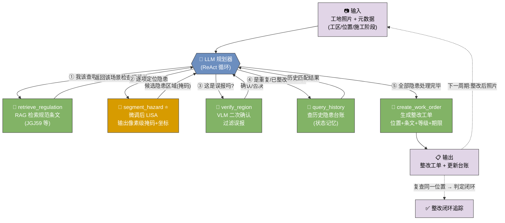
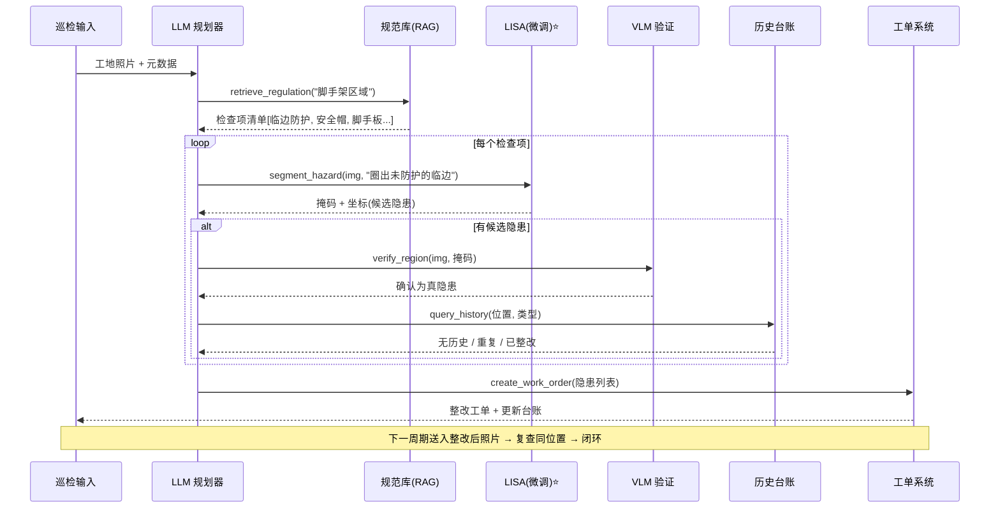

# Agent 应用开发岗 · 面试准备文档

> 目标岗位:Agent 应用开发
> 简历项目:在建筑施工场景对多模态模型 LISA 做微调
> 更新日期:2026-07-04

---

## 0. 一句话定位(先想清楚)

**LISA 本质是"推理分割"(reasoning segmentation)多模态模型,不是 Agent。**
面试 Agent 岗位时,面试官第一个问题很可能是:"这跟 Agent 有什么关系?"
必须先打通这个逻辑,否则项目会被认为"跑偏"。

正确叙事:

> 构建一个**施工安全巡检 Agent**,LISA 作为其中的"**视觉定位工具**",被 LLM 规划器按需调用。

这样同时讲清两件事:**多模态微调能力** + **Agent 系统设计能力**——这才是 Agent 岗位想要的。

---

## 1. LISA 在 Agent 里的角色

LISA 的能力:根据自然语言复杂指令,输出图像中对应区域的分割掩码(reasoning segmentation)。

在建筑施工场景,它天然适合做 **Agent 的一个视觉工具 / 感知节点**,而不是 Agent 本身。

- LISA = 一个 tool(输入:图像 + 指令,输出:掩码 + 坐标)
- LLM 规划器(function calling / ReAct)负责:看图 → 判断 → 调用 LISA 定位 → 生成整改工单

---

## 2. 场景选型(核心:必须"非 Agent 不可")

### 判断标准:一个场景值得做成 Agent,必须至少满足其一

1. **多工具编排** — LISA 只是其中一个工具,还需检索(规范条文)、验证(VLM 二次确认)、生成(工单/报告)等协同。
2. **多步推理 / 自我修正** — 需要"调用→看结果→再决策→再调用"的循环,而非一问一答。
3. **跨时间的状态记忆** — 需要对比历史、追踪闭环、去重。

> 反问自己:**如果 LISA 的输出能直接当最终答案,就不需要 Agent。** 每个场景都要能回答"为什么不能一次调用搞定"。

---

### 场景 A(主打推荐):施工安全隐患巡检 + 整改闭环 Agent

**痛点**:工地安全隐患靠人工巡检,漏检率高、整改追踪靠 Excel、事故成本极高。固定类别检测(YOLO)只能查"有没有安全帽",查不了"临边是否缺防护""脚手板是否满铺"这类**组合语义/开放语义**隐患。

**为什么必须是 Agent(而不是单模型)**:
- 判定"是否违规"需要**检索规范条文**(如 JGJ59《建筑施工安全检查标准》),LISA 只能定位不能判定 → 需要 RAG 工具。
- LISA 会误报,需要 **VLM 二次确认**降低误报 → 需要验证工具。
- 隐患要**追踪整改闭环**(本周隐患下周是否整改),需要对比历史台账 → 需要记忆/状态。
- 最终要产出**整改工单**(位置+条文+等级+期限)→ 需要生成工具。

**Agent 工具集与循环**:
```
输入:工地照片 + 元数据(工区、位置、施工阶段)
1. retrieve_regulation(场景)   → 检索该区域适用的规范检查项(RAG)
2. 规划器据条文列出待查隐患项  → ["临边防护缺失","未戴安全帽","脚手板未满铺"...]
3. segment_hazard(img, 指令)   → 调用微调后 LISA 逐项分割定位  ← 核心微调点
4. verify_region(img, mask)     → VLM 二次确认,过滤误报
5. query_history(位置, 类型)    → 查历史台账:是否重复隐患/是否已整改
6. create_work_order(...)       → 生成整改工单 + 更新台账
—— 下一周期:输入整改后照片 → 复查同一位置 → 闭环
```

**LISA 的不可替代性**:输出**像素级掩码**(不只是框),可精确定位 + 面积测算(如"未防护临边长度""空鼓面积占比"),这是通用 VLM 给不了的。

**可量化指标**:隐患漏检率、误报率(加 VLM 验证前后对比)、mIoU/gIoU、整改闭环率、单张巡检耗时(人工 vs Agent)。

#### 图 1:整体工具调用流程图(ReAct 编排 + 闭环)



> ⭐ = 唯一需要**微调**的组件;其余工具用现成能力(RAG / 通用 VLM / DB / 模板)拼装。这张图的重点是让面试官一眼看到:**LISA 是被规划器编排的一个工具,不是系统本身。**

#### 图 2:一次巡检的时序图(工具调用顺序)



#### 场景 A · 关键设计点答辩(面试高频追问)

**Q1:"verify_region 那步 VLM 二次确认是干嘛的?能不能只用 LISA?"**

- **VLM = Vision-Language Model**(视觉语言模型,如 GPT-4V / Qwen-VL),能"看图 + 理解文字 + 文字作答"。
- **作用**:LISA 分出候选隐患区域后不直接采信,把该区域再喂给通用 VLM 问一道是非题("这个工人戴安全帽了吗?只答'戴了/没戴'"),确认是真隐患才保留,否则丢弃。
- **为什么需要**:LISA 擅长**定位**,但对"算不算违规"会**误报**;单独用误报率高 → 现场天天收假工单 → 系统失信。用 VLM 做复核 = **用工程手段兜住单模型缺陷**。
- **分工类比**:LISA = 眼尖实习生(快速圈出可疑) / VLM = 老师傅(逐个把关) / LLM 规划器 = 工头(决定流程)。
- **为什么两个都要**:LISA 定位准但会多报、VLM 判断稳但定不准(给不了掩码),**互补**,合起来才既准又稳。

| | LISA(微调) | 通用 VLM |
|---|---|---|
| 输出 | 像素级掩码 + 精确坐标 | 文字描述 / 粗框 |
| 强项 | 精确定位、可测面积/长度 | 语义判断、是非题 |
| 弱项 | 会误报 | 定位不准、无掩码 |

**Q2:"query_history(位置, 类型) 这步的目的是什么?"**

服务三个目的:
1. **去重** — 同一隐患连续几天被拍到,避免重复开单;已开过则只更新状态。
2. **整改闭环判定(核心)** — 上周开单的位置本周复查:还在→催办升级,消失→自动关单 ✅。**没这步系统只会不停"发现新隐患",永远不知道旧的改没改。**
3. **顽固隐患预警** — 同位置同类隐患反复出现(开单→整改→又现),识别"第 N 次",升级推给管理层。

- **为什么能证明"必须是 Agent"**:直接命中"三条标准"里的**第 3 条·跨时间状态记忆**。单次模型调用是**无状态**的,看完这张图就忘,不可能知道"上周有没有开过单";只有 Agent(带外部台账)能跨时间追踪。
- **实现很轻**:就是查一张隐患台账表,按"位置+类型"匹配(位置用工区编号 / 摄像头 ID / 掩码坐标聚类对齐),**不需要训练模型**,纯工程组件 → 呼应"只有 LISA 需微调,其余现成拼装"。

---

### 场景 B:施工质量验收 Agent(清单驱动)

**痛点**:验收要逐条对照规范检查表(露筋、蜂窝麻面、瓷砖空鼓、涂料开裂…),人工逐项拍照记录效率低、易漏项。

**为什么必须是 Agent**:验收本质是**清单驱动的多步流程**——Agent 遍历检查表,对每个可视化项判断是否需要视觉核查、路由到 LISA 定位对应缺陷、再聚合成验收报告。是"逐项规划 + 工具路由 + 结果聚合",天然多步。

**LISA 角色**:"标出出现露筋的混凝土构件""圈出瓷砖空鼓/开裂区域"——领域缺陷的开放语义分割。

**可量化**:检查项覆盖率、缺陷检出率、报告生成耗时。

---

### 场景 C:形象进度核查 Agent(多源比对)

**痛点**:项目进度上报靠人工估算,水分大;需要照片 vs 计划进度自动比对。

**为什么必须是 Agent**:需要融合**多数据源**——施工计划/BIM 阶段定义 + 现场照片 + 时序对比。规划器先查"该区域按计划应到什么阶段",再调 LISA 分割"已完成砌筑未抹灰的墙面",算出偏差。单模型没有计划数据,做不了判定。

**可量化**:进度识别准确率、与实际偏差、上报效率提升。

---

### 选型结论

**主打场景 A**(安全隐患巡检 + 整改闭环):
- Agent 契合度最高(4 个工具 + 状态记忆闭环,三条标准全中);
- LISA 不可替代性最强(像素级掩码 + 领域语义);
- 业务价值最直观(安全事故成本高);
- 指标最好量化(漏检率、闭环率)。

**B、C 作为"扩展性/未来工作"在面试里提一句**,展示你的产品化视野和架构可复用性(同一套 Agent 框架换工具/换 prompt 即可扩展),但不铺开做——**一个深项目 > 三个浅项目**。

---

## 2.5 面试故事线(STAR,可直接口述 2 分钟)

> 面试官听的不是"你会微调",而是"你会不会定义问题、做技术取舍、扛住落地难题"。

**S 背景**:施工现场安全隐患靠人工巡检,漏检率高、整改追踪靠 Excel。业务方想要"拍张照就能自动查隐患并追踪整改"。难点在于——隐患是**开放/组合语义**("临边未防护""脚手板未满铺"),固定类别检测模型覆盖不了。

**T 任务**:我负责设计并落地一个**安全巡检 Agent**,能理解自然语言隐患描述、精确定位、判定违规、生成并追踪整改工单。

**A 行动 & 取舍**(重点讲"为什么这么选"):
1. **为什么用 Agent 而非单模型**:判定违规要查规范、要降误报、要追踪闭环——是多工具多步流程,所以用 ReAct 规划器编排 LISA / RAG / VLM / 工单 四类工具。
2. **为什么微调 LISA 而非直接用 GPT-4V/Qwen-VL**:①通用 VLM 只给粗坐标、无像素掩码,量不了"未防护临边长度";②对施工领域概念(临边、脚手板、露筋)理解差;③工地数据合规 + 私有化部署 + 延迟成本,不能走云。→ 用 LoRA 给 LISA 注入领域语义,单卡可训。
3. **数据怎么来**:没有现成"指令-掩码"数据,我设计了半自动合成流水线——用现成检测数据集生成掩码,再用 LLM 把类别改写成推理式指令,人工抽检。
4. **误报怎么办**:LISA 单独用误报偏高,我在 Agent 里加了 VLM 二次确认这一步,用工程手段兜住模型缺陷。

**R 结果**:施工场景 mIoU 从 A→B,加验证步后误报率降 X%,整改闭环可自动追踪,单张巡检从人工 N 分钟降到 M 秒。(数字待补)

**一句话升华**:这个项目让我理解到——**Agent 的价值不在单个模型多强,而在于用编排和工程手段把不完美的模型组合成可用的闭环系统。**

---

## 3. 技术落地路径(体现深度)

1. **数据合成 Pipeline(简历核心亮点,已落地代码见 `data_pipeline/`)**

   **问题**:LISA 训练需要 `(图像, 推理指令, 分割掩码)` 三元组,无现成数据、纯人工标注极贵。
   **思路**:把便宜的"检测框"数据零标注升级为 LISA 数据。

   ```mermaid
   flowchart LR
     U["无框原始图/视频"] --> G["Stage 0-<br/>grounded_ingest<br/>抽帧+开放词表检测<br/>+规则推导隐患"]
     G --> R
     R["Stage 0<br/>检测框数据<br/>(图 + bbox + 类别)"] --> M["Stage 1<br/>框→掩码<br/>复用 SAM(box prompt)"]
     M --> H["Stage 2<br/>类别→隐患<br/>taxonomy 映射"]
     H --> I["Stage 3<br/>生成推理指令<br/>模板库 + LLM 改写"]
     I --> P["Stage 4-5<br/>掩码→多边形<br/>组装 LISA json"]
     P --> Q["Stage 6<br/>质检抽样 + train/val 划分"]
     classDef k fill:#d79b00,stroke:#333,color:#fff;
     class M,I,G k;
   ```

   **两种输入**:①已有检测框 → 直接进 Stage 0;②**无框原始图/视频** → 先过 `grounded_ingest`
   (Grounding DINO 出基础实体框 + 几何规则推导隐患)→ 再进主流程。
   > 面试要点:开放词表检测器只懂"实体"不懂"否定语义"(person without helmet),
   > 所以先检测 person/helmet,再用**几何规则**("头部区域无 helmet 重叠 = 未戴")组合出隐患——
   > 组合语义交给规则,不硬塞给检测器。视频还可用 SAM 2 掩码传播,一帧标注传播多帧。

   | Stage | 做什么 | 关键取舍 |
   |---|---|---|
   | 1 框→掩码 | 用 bbox 作 SAM 的 box prompt,得像素级掩码 | **复用仓库自带 SAM,零人工标注**,把检测数据变分割数据 |
   | 3 生成指令 | 类别名 → 组合语义推理指令("圈出没戴安全帽的工人") | 模板库保稳定 + LLM 改写增多样,防过拟合固定句式 |
   | 4-5 组装 | 掩码→多边形→LabelMe json | **产物规格与 `get_mask_from_json` 完全对齐**,直接可训 |
   | 6 质检 | 面积/IoU 自动过滤 + 可视化人工抽检 | 用工程阈值挡掉 SAM 跑偏的坏样本 |

   - 产物:`<name>.jpg` + `<name>.json`(`shapes`=多边形,`text`=指令,`is_sentence=true`)。
   - 组合语义隐患(如"临边无防护")现成数据少 → 规则/少量人工补充后再进 pipeline。
   - **面试话术**:"我没有靠死标注,而是设计了一条 SAM+LLM 的自动合成流水线,把标注成本从 O(N) 降到接近 0,只保留少量人工抽检。"

2. **微调**
   - LISA 用 **LoRA** 微调,单卡即可跑。
   - 注意保留原有 SAM/CLIP 权重,只调 LLM + 投影层。
   - 记录:显存、训练时长、可训练参数占比。

3. **Agent 集成(重点)**
   - 把微调后的 LISA 封装成一个 tool(输入:图像 + 指令,输出:掩码 + 坐标)。
   - 接入 LLM 规划器(function calling / ReAct)。
   - 实现闭环:看图 → 判断 → 调用 LISA 定位 → 生成整改工单。

4. **评估**
   - 准备小测试集,报 **mIoU、gIoU、漏检率**。
   - 做**微调前后对比**。

---

## 4. 简历写法(STAR + 量化)

**反例(太弱)**:
> 微调了 LISA 多模态模型用于施工场景

**正例**:
> **施工安全巡检 Agent(多模态)** — 设计并实现以微调 LISA 为视觉工具的 ReAct Agent,支持自然语言指令定位施工现场安全隐患。构建"检测框→掩码→推理指令"的半自动数据合成流水线,生成 N 组训练样本;基于 LoRA 微调 LISA(可训练参数仅占 X%,单卡 24G),施工场景 mIoU 从 A 提升至 B;将模型封装为 tool 接入 LLM 规划器,实现"识别→定位→生成整改工单"闭环。

**关键**:每句话尽量带一个数字(样本量、参数量、显存、mIoU 提升、推理延迟)。

---

## 5. 面试高频追问(提前准备答案)

1. **"这为什么是 Agent 而不只是个模型?"**
   → 讲规划器 / 工具调用 / 多步闭环设计。

2. **"为什么用 LISA 而不用 YOLO/SAM 直接检测?"**
   → 需要开放式语义推理("没戴安全帽的人"是组合语义,固定类别检测做不到)。

3. **"数据从哪来、怎么保证质量?"**
   → 数据合成 + 人工抽检流程。

4. **"效果怎么衡量、有没有 bad case?"**
   → 一定要能说出失败案例和分析。面试官最反感只报好数字的人。

---

## 6. 待办 / 下一步

- [ ] 确定具体场景(默认:安全合规检测)
- [ ] 阅读本仓库 LISA 训练/推理代码,产出可执行的微调步骤 + LoRA 配置
- [ ] 设计数据合成 pipeline 代码框架
- [ ] 搭 Agent 集成层最小原型(tool 封装 + 规划器)
- [ ] 跑通微调前后评估,收集量化数字填进简历
